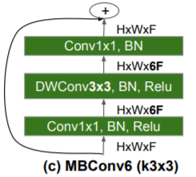

# Log

| Changes                                                      | Result                                                      | Ideas for next steps                                         |
| ------------------------------------------------------------ | ----------------------------------------------------------- | ------------------------------------------------------------ |
| Run notebook https://www.kaggle.com/phoenix9032/center-resnet-starter | public LB 0.020, place ~660/800                             | Seems low place ->Test more popular notebook by Rusian       |
| Run notebook https://www.kaggle.com/hocop1/centernet-baseline | public LB 0.031, place 550/800                              | Better start, seems okay as a baseline. -> Implement prediction pipeline yourself |
| Own implementation of previous notebook (in particular data loading and inference pipeline). Only use model weights by hocop1 / ruslan | public LB 0.006                                             | something is still wrong, despite predicted images seem okay :/ -> compare code to original notebook |
| Fixed stuff in reimplementation and integrated optimize_xy function. Now, prediction is exactly equal using original weights | public LB 0027                                              | Should also score 0.031 ?  -> Try with my weights and see what happens |
| Exact same using my weights                                  | public LB 0.034, place 502/810                              | surprisingly large difference. -> Next: Evaluate improvement idea collection and start gradually |
| Increased model input size from 1024x320 to 1536x512 (without modifying layers. Maybe another convolution would be necessary, because effective window size decreases?). Added another upsample convolution to increase output size to 384x128 (before 128x40) | x - aborted training after epoch 4                          | mask loss dominates. -> Change weights s.t. mask and regr loss are similar |
| Changed weights, so that mask and regr loss are same order of magnitude, see https://www.kaggle.com/c/pku-autonomous-driving/discussion/115673 | public LB 0.062, place 109/820                              | :)  -> Next: choose next improvement idea                    |
| Major change: Switched from binary loss to focal loss for mask. Minor change: Excluded five erroneous images from training set | public LB 0                                                 | :( Mask seems great, but regression values are totally wrong |
| In training: Changed regression loss by extracting binary mask from heatmap mask. Also changed learning rate scheduler slightly. In prediction post-processing: Disable optimization if optimized values don't make sense.  (20200112_focal_loss_v2 / model_6) | public LB 0.044                                             | My impression is that learning is not yet finished. Could achieve better score by training more -> Train focal loss more and disable LR decay. Also, why is loss_regr so high? Was 0.13 before, now at 0.51? Tried learning more, but then overfits... -> Focal loss not effective? -> |
| (In parallel to training above): Trained a new model with focal loss, image augmentation and usage of provided masks. | public LB 0.005                                             | Somehow very few car predictions, especially near cars. Focal loss w/out image augmentation & w/out mask is much better. Is something off with augmentation after all?! No, I guess just too much augmentation and current usage of mask not effective. Rather concat mask to image! |
| Changes: (1) Found issue with focal loss ! labels had values >1, which resulted in slightly weird loss terms  (2) Use mask through concatenation instead of through simply masking camera image (3) Significantly reduce image augmentation | 0.055 (without aug) & 0.041 (with aug and shorter training) | Training was not complete, but had to hand in results due to deadline. regr_loss was 0.45 at the end, but I believe it would still have gone down (much) further... A pity, but a fun and learning experience anyway. |
|                                                              |                                                             |                                                              |

# Improvement idea collection
- larger image `size` 1536*512
  - together with focal loss achieves LB 0.078, see https://www.kaggle.com/c/pku-autonomous-driving/discussion/123193
- change to focal loss (?)
  - https://www.kaggle.com/c/pku-autonomous-driving/discussion/121608
  - https://www.kaggle.com/c/pku-autonomous-driving/discussion/115673
  - heatmap, see https://www.kaggle.com/c/pku-autonomous-driving/discussion/123090
  - use AdamW optimizer, see https://www.kaggle.com/c/pku-autonomous-driving/discussion/121608
- hyperparameters
  - theory about learning rate (lr)
    - If `batch_size*=k`, one should set `lr*=sqrt(k)`or `lr*=k`. However, using adaptive optimizers (e.g. Adam), lr can stay constant. See https://stackoverflow.com/questions/53033556/how-should-the-learning-rate-change-as-the-batch-size-change
    - lr=0.001 good default value for Adam, see https://mlfromscratch.com/optimizers-explained/#/ and original paper https://arxiv.org/pdf/1412.6980v9.pdf
    - Use AdamW instead of Adam? https://towardsdatascience.com/adam-latest-trends-in-deep-learning-optimization-6be9a291375c
- exclude broken images in training, see https://www.kaggle.com/c/pku-autonomous-driving/discussion/117621
  - ID_1a5a10365.jpg
  - ID_4d238ae90.jpg
  - ID_408f58e9f.jpg
  - ID_bb1d991f6.jpg
  - ID_c44983aeb.jpg
- model backbone. Options:
  - efficientnet b0 (LB 0.078 with above changes)
  - Hourglass104
  - DLA34
- image augmentation: horizontal flip, random brightness, gaussian noise and contrast in training. -> only slight improvement
  - Pay attention to horizontal flipping, not so easy, see https://www.kaggle.com/c/pku-autonomous-driving/discussion/125591
- use masks, see https://www.kaggle.com/c/pku-autonomous-driving/discussion/122942
- calc LB yourself and use it to evaluate model after each epoch
  - https://www.kaggle.com/c/pku-autonomous-driving/discussion/117578
  - https://www.kaggle.com/c/pku-autonomous-driving/discussion/124870
- instead x,y,z estimate (u,v),depth! Maybe much simpler task? But requires significant restructuring
- include test set in training via pseudo labels, see https://www.kaggle.com/c/pku-autonomous-driving/discussion/124912
- use more than one model and ensemble them
- In general a detailed error analysis. For example
  - What is the kpi on near / distant cars?
  - Which thresholds are reached, which not? Is the limiting factor the rotational or the translational error?
- Use GroupNorm instead of BatchNorm, see https://www.kaggle.com/c/pku-autonomous-driving/discussion/122469 and  https://medium.com/syncedreview/facebook-ai-proposes-group-normalization-alternative-to-batch-normalization-fb0699bffae7

### Effective window size

- layers
  - from https://arxiv.org/pdf/1905.11946.pdf
    - 
  - from https://ai.googleblog.com/2019/05/efficientnet-improving-accuracy-and.html
    - 
- MBConv1 and MBConv6
  - from https://arxiv.org/pdf/1807.11626.pdf
    - 
  - from https://forums.fast.ai/t/efficientnet/46978/76
    - "When the paper is talking about MBConv1 or MBConv6 they mean MBConv with an expansion factor of 1 and 6, respectively. The MBConv1 block does not come with the first expansion 1x1 conv since there is nothing to expand (expansion factor 1); this block starts with a depthwise separable convolution immediately."


# Lessons learned

- kaggle specific
  - Simply download the predictions.csv output file from a notebook to evaluate its score instead of rerunning the whole notebook and waiting 12h
  - Instead of starting code from scratch rather refactor the existing notebook code. While starting from scratch is a greater learning experience and produces more structured code (in my view), it is quite difficult and cumbersome to get all details right in the reimplementation and thus have a defined starting point.
- More general
  - Buy a decent GPU. Solution now was to use either a free google colab GPU via ssh and pycharm remote (possible through ngrok "hack") or sometimes the free kaggle GPU. However, both have disadvantages (see details below). Often, I would start 1-2 trainings in the evening and I would find both of them aborted the next morning :/.
    - Usage of the kaggle GPU is limited to 30h/week and importing the code is tedious. Moreover, during commiting, you cannot see any output and thus detect e.g. a nan-loss.
    - Google colab sessions have an official time limit of 12h, but in reality training often already stopped after e.g. 4-5h or sometimes even earlier to my surprise. Moreover, I was never able to acquire a GPU backend in the day, only in the evenings.
    - At the end, I invested into a google cloud GPU (P100). While it was much more productive than colab, the connection was not 100% stable, the server was sometimes unavailable and analyzing output images requires a time-consuming download at first.
  - Work with larger validation set (currently only 1%) so that can be used for real evaluation (because test set online can only be used 2x a day)
  - Only change one thing at a time. Due to the limited GPU availability, I sometimes changed several things at one time and could not assess the effects of each change. Resist the temptation...
  - Compare losses not only between epochs, but also between different models. If something is significantly different, question it.
  - Pytorch parameters num_workers>2 and pin_memory=True speed up training by a factor of ~3
  - Research even more before implementing. 


# Idea for more efficient GPU use

- Use local GPU and a tiny model (e.g. 1/8 of channels) to test code locally
- Use 2 GPUs for actual training (so that I can train and test new stuff in parallel !):
  - google colab
    - data -> download from kaggle into gdrive once
    - code -> transfer via ssh to gdrive (or via web to gdrive). Start trainings from within notebook, so that local GPU free. 
  - kaggle
    - data -> already in kaggle
    - code -> transfer via github.
      - Or can I also mount gdrive? Would be even simpler! -> Seems complicated, see below. Probably not worth, given that the GPU quota limits training to 30h / week anyhow, which means ~ 2 trainings / week
        - https://developers.google.com/drive/api/v3/quickstart/python
        - https://towardsdatascience.com/how-to-manage-files-in-google-drive-with-python-d26471d91ecd
- github vs ssh
  - github
    - (+) quick to setup
    - (-) cannot debug or set breakpoints
  - ssh + pycharm remote
    - (-) need to run ssh, ngrok and click event. Potentially more unstable?
    - (+) code is copied instantaneously
- -> add additional params (to overwrite) via argparse
  - location of data
  - flag_simplify_model (only for local running!)

# How to use (paid) google cloud service?

### Overview

- see https://cloud.google.com/tpu/docs/tutorials/pytorch-pod
- https://medium.com/google-cloud/gcp-the-google-cloud-platform-compute-stack-explained-c4ebdccd299b
  - google compute engine (GCE) - pure infrastructure (CPU, GPU, Ram)
    - -> use for custom containers, see e.g. https://medium.com/udacity-pytorch-challengers/pytorch-on-google-cloud-platform-gcp-66644bfc07eb
    - see tutorials
      - https://cloud.google.com/blog/products/ai-machine-learning/introducing-pytorch-across-google-cloud
      - https://cloud.google.com/ai-platform/deep-learning-vm/docs/pytorch_start_instance
    - see sets of VMs here: https://cloud.google.com/deep-learning-vm/
  - google Kubernets engine (GKE) - similar to docker containers ?!
    - also see https://www.kubeflow.org/ -> I guess not necessary at the moment
    - e.g. a pytorch image, see https://medium.com/udacity-pytorch-challengers/pytorch-on-google-cloud-platform-gcp-66644bfc07eb
  - google App engine (GAE) - will handle automatic scaling up/down, sits on top of kubernete
  - google cloud functions - specific functions, usually trigger based (e.g. upon mail arrival)
- TODO later
  - configure idle time, see https://cloud.google.com/datalab/docs/concepts/auto-shutdown

### Connect to server via SSH

- SSH and SFTP see https://cloud.google.com/compute/docs/instances/transfer-files#scp
  
  - Setup firewall rule, see https://cloud.google.com/vpc/docs/using-firewalls
    
    - -> already default
    
  - Setup key-pair (public private ?!) , see https://confluence.atlassian.com/bitbucketserver/creating-ssh-keys-776639788.html
    
    - -> already one in "C:/Users/<account>/.ssh" or "~/.ssh" in git-bash
    
  - Add public key to gcloud, see https://cloud.google.com/compute/docs/instances/adding-removing-ssh-keys
  
    - -> done
  
  - Connect to server using git-bash and ssh, via following command
  
    - ```
      ssh username@ssh.server.com -p 22 
      ```
    
  - using pycharm, see https://blog.jetbrains.com/pycharm/2017/08/ssh-agent-simplify-ssh-keys/
  
    - -> really easy (even detected my public key)